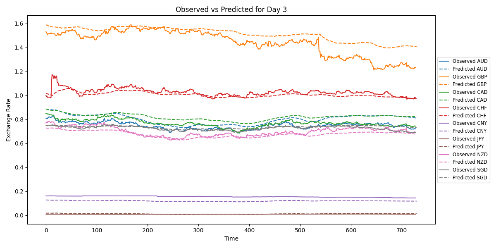

# Forecasting: Exchange Rate

This application focuses on forecasting the daily exchange rates of eight foreign currencies to USD for up to seven days ahead. The currencies include AUD, GBP, CAD, CHF, CNY, JPY, NZD, and SGD, with historical data ranging from 1990 to 2016.

## Table of Contents
- [Introduction](#introduction)
- [Data](#data)
- [Methods](#methods)
- [Results](#results)
  - [Evaluation Metrics](#evaluation-metrics)
  - [Time Series Plots](#time-series-plots)
- [Directory Structure](#directory-structure)
- [Installation](#installation)
  - [Conda Environment Setup](#conda-environment-setup)
  - [Docker Setup (Optional)](#docker-setup-optional)
- [Usage](#usage)
  - [Run Main Script](#run-main-script)
  - [Run Each Source Module (Optional)](#run-each-source-module-optional)
    - [Data Preparation](#data-preparation)
    - [Training](#training)
    - [Evaluation](#evaluation)
    - [Inference](#inference)

## Introduction

The application uses a transformer-based architecture to forecast exchange rates to USD for eight major currencies. The aim is to predict exchange rates for one to seven days ahead using historical daily exchange rate data.

Below is an example plot of the observed versus predicted exchange rates for three days ahead. Each currency is represented by a unique color for both observed and predicted values. The solid curves correspond to observed exchange rates, while the dashed curves represent the predicted exchange rates for the same currency.



## Data

The dataset is a collection of daily exchange rates of eight foreign currencies from 1990 to 2016. The data was obtained from [this Multivariate Time Series Data Sets repository](https://github.com/laiguokun/multivariate-time-series-data). The dataset includes exchange rates for:
- AUD (Australian Dollar)
- GBP (British Pound)
- CAD (Canadian Dollar)
- CHF (Swiss Franc)
- CNY (Chinese Yuan)
- JPY (Japanese Yen)
- NZD (New Zealand Dollar)
- SGD (Singapore Dollar)

## Methods

Transformers are a type of neural network architecture designed for sequence-to-sequence tasks, relying on the mechanism of self-attention to weigh the importance of different input elements relative to each other. Unlike recurrent architectures, transformers process the entire sequence simultaneously, enabling parallel computation and better handling of long-range dependencies. Transformers have revolutionized fields like natural language processing and time-series forecasting due to their scalability and performance.

Our transformer model is customized for time-series forecasting, using a modular architecture with a currency embedding layer, a multi-layer transformer encoder-decoder, and a linear decoder to produce predictions. It has a hidden dimension of 64, four attention heads, and four encoder and decoder layers, making it well-suited for capturing complex temporal dependencies across multiple currencies.


*Figure from [The Transformer Blueprint: A Holistic Guide to the Transformer Neural Network Architecture by Jean Nyandwi](https://deeprevision.github.io/posts/001-transformer/#ref-vaswani2017attention).*

> Vaswani, A., Shazeer, N., Parmar, N., Uszkoreit, J., Jones, L., Gomez, A. N., Kaiser, Ł., & Polosukhin, I. (2017). Attention Is All You Need. NeurIPS.  
  [Paper link](https://arxiv.org/abs/1706.03762)

## Results

The model was evaluated on the test period, consisting of 760 days mostly from 2015–2016, with a few from 2014. Below is a summary of the results:

### Evaluation Metrics

#### Average Evaluation Metrics for One-Day Ahead
- **MSE**: 0.001947
- **RMSE**: 0.038120
- **MAE**: 0.033063
- **MPAE**: 0.264552
- **R^2**: -79.336527

#### Average Evaluation Metrics for Three-Day Ahead
- **MSE**: 0.002163
- **RMSE**: 0.039236
- **MAE**: 0.034094
- **MPAE**: 0.114651
- **R^2**: -14.225206

#### Average Evaluation Metrics for Seven-Day Ahead
- **MSE**: 0.002122
- **RMSE**: 0.038654
- **MAE**: 0.033229
- **MPAE**: 0.246668
- **R^2**: -72.986661

The R^2 values for CNY and JPY sometimes appear extremely negative due to the very small variance in the observations. Because R^2 is highly sensitive to the scale of variance, even minor mismatches between predictions and observations can result in disproportionately large negative values. In such cases, other metrics provide more reliable indicators of model performance for CNY and JPY.

### Time Series Plots
The time series plots of observed versus predicted exchange rates for each forecasting horizon (one-day to seven-day ahead) can be found in the `results/evaluation/` directory under the filenames `plot_day_*.png`.

## Directory Structure

```
forecasting-exchange-rate/
├── configs/                             # Pre-trained transformer weight files
├── data/                                # Dataset
│   ├── preprocessed/                    # Preprocessed dataset
│   └── raw/                             # Raw downloaded file
├── Dockerfile                           # Docker setup
├── environment.yml                      # Conda environment setup
├── LICENSE                              # Project license
├── main.py                              # Main pipeline script
├── README.md                            # Project README
├── requirements.txt                     # Python dependencies
├── results/                             # Outputs from inference and evaluation
│   ├── evaluation_metrics_day_*.csv     # Evaluation metrics CSVs
│   └── plot_day_*.png                   # Observed versus Predicted plots
├── src/                                 # Source code
│   ├── data.py                          # Data preparation script
│   ├── eval.py                          # Evaluation script
│   ├── infer.py                         # Inference script
│   └── train.py                         # Training script
└── transformer.png                      # Illustration of a transformer
```

## Installation

### Conda Environment Setup

1. Clone the repository:
   ```bash
   git clone https://github.com/your-ai-solution/forecasting-exchange-rate.git
   cd forecasting-exchange-rate
   ```

2. Create a Conda environment:
   ```bash
   conda env create -f environment.yml
   conda activate forecasting-exchange-rate
   ```

3. Install dependencies:
   ```bash
   pip install -r requirements.txt
   ```

### Docker Setup (Optional)

1. Build the Docker image:
   ```bash
   docker build -t forecasting-exchange-rate .
   ```

2. Run the Docker container:
   ```bash
   docker run --gpus all -v $(pwd)/data:/app/data -v $(pwd)/results:/app/results forecasting-exchange-rate
   ```

##  Usage

### Run Main Script

1. Place [the dataset GZ](https://github.com/laiguokun/multivariate-time-series-data/blob/master/exchange_rate/exchange_rate.txt.gz) in `data/raw/`. 

2. Run the main script that automates the entire pipeline:
   ```bash
   python main.py
   ```

### Run Each Source Module (Optional)

1. Data preparation: Preprocess the dataset.
   ```bash
   python -m src.data
   ```

2. Training: Train a transformer model.
   ```bash
   python -m src.train
   ```

3. Evaluation: Evaluate the transformer model.
   ```bash
   python -m src.eval
   ```

4. Inference: Run inference on the test period.
   ```bash
   python -m src.infer
   ```